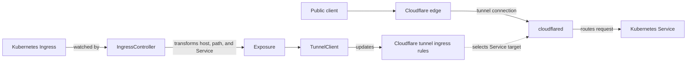
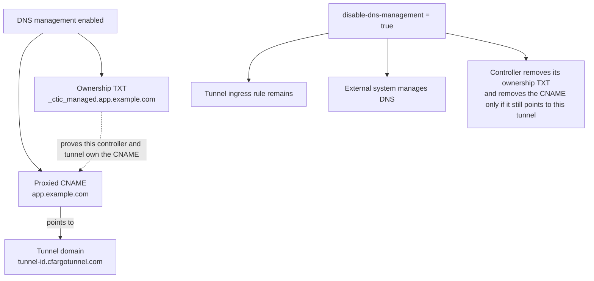
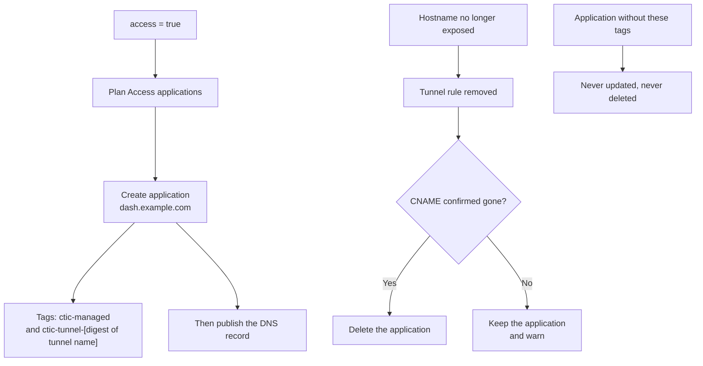

Cloudflare Tunnel Ingress Controller connects two control planes. Kubernetes Ingress resources describe which Services should be exposed, while Cloudflare holds the public DNS records and tunnel routing configuration. The controller continuously translates the Kubernetes view into the Cloudflare view.

Traffic does not pass through the controller itself. The controller manages configuration. The `cloudflared` connectors carry traffic from Cloudflare into the cluster.

## From Ingress to tunnel route

`IngressController` watches Kubernetes Ingress resources and selects those assigned to its Ingress class. When one changes, the controller reads all controlled Ingress resources again. This full view matters because the Cloudflare tunnel configuration is one ordered list of ingress rules, rather than one independent object per Kubernetes Ingress.

An `Exposure` is the internal boundary between Kubernetes and Cloudflare. It holds the public hostname, path prefix, Service target, and origin options. `TunnelClient` turns active Exposures into an ordered rule list, with specific hostnames before wildcards, longer paths before shorter paths, and a final HTTP 404 rule.

The controller stays outside the request path. It writes configuration, while `cloudflared` maintains outbound tunnel connections and forwards public traffic to the Service selected by the matching rule.

See the [Ingress reference](/reference/ingress/) for supported route behavior and validation rules.

## DNS and ownership

The CNAME sends public traffic toward `<tunnel-id>.cfargotunnel.com`. The TXT record gives cleanup a safe ownership boundary, so a matching ownership record is required before normal reconciliation deletes a CNAME.

With `disable-dns-management: "true"`, only DNS responsibility changes. The Exposure still becomes a tunnel rule, but the controller stops creating or updating DNS records and permits hostnames outside its visible Cloudflare zones. When relinquishing records it previously managed, it preserves any CNAME another system has already repointed.

See the [Ingress annotations reference](/reference/ingress-annotations/) for annotation syntax and related origin settings.

## Access applications and ownership

Access applications belong to the Cloudflare account rather than to a zone, so this path involves no zone lookup and no zone grouping. One application covers one hostname.

An application has no comment field, so ownership cannot ride on a record the way DNS ownership rides on the `_ctic_managed` TXT record. It rides on two tags instead: a fixed `ctic-managed` tag and a `ctic-tunnel-<digest>` tag derived from the tunnel name. The digest, rather than the name itself, is what the tag carries: Cloudflare caps a tag name at 35 characters, and a tunnel name is operator input of unbounded length, so a tag with the name in it is a tag whose length the operator controls. The tunnel _name_ is the same identity the DNS ownership record uses, and the controller reuses a tunnel by name, so a tunnel deleted and recreated under the same name keeps its applications instead of orphaning every one of them. Scoping the second tag to the tunnel is also what keeps two clusters that share a Cloudflare account from pruning each other's applications.

The sync is deliberately split around the DNS step. An application is created before the DNS record publishes its hostname, and it is deleted only after the tunnel rule is gone and, for a hostname that is no longer exposed at all, only after the DNS record is confirmed gone. A DNS step that returns success is not the same thing as a record that is absent: when another system has repointed a hostname the controller preserves that record deliberately. The DNS step therefore reports back which hostnames it actually cleared, and an application whose hostname is not in that set is retained with a warning rather than removed from something still being served.

What that ordering buys is one-directional, and it is worth being precise about what it does not buy. An interrupted sync can leave an application protecting nothing, and never a hostname that _this controller published_ without the application its Ingress asked for. There are two states it does not rule out, and neither is a bug in the ordering.

The first is an application deleted _outside_ Kubernetes. A deletion in the Cloudflare dashboard changes nothing an event-driven controller can see, so the hostname stays public and unprotected until something reconciles. That is why the controller re-checks its applications on a timer, `access.resyncInterval`. The timer, not the ordering, is what bounds how long a hostname can be public after its application is deleted elsewhere, and setting the interval to `0` removes the bound entirely.

The second is the hostname that was already public before you asked for Access. Turning Access on for a hostname the controller published earlier does not withdraw anything: the sync plans the Access work first and returns on failure before it reaches DNS, so if the Access step keeps failing, for example because the token has no Access permission yet or the account cannot be listed, the tunnel rule and the CNAME from the earlier successful sync both stay exactly where they are. The hostname keeps serving, publicly, with no application in front of it, for as long as the failure lasts. `access.resyncInterval` does not bound this one, because the resync re-enters the same failing sync. What you get instead is a `CloudflareSyncFailed` event on the Ingress, `cloudflare_tunnel_ingress_controller_cloudflare_api_errors_total` climbing, and `last_successful_sync_timestamp_seconds` going stale. Retrofitting Access onto a live hostname is therefore the one flow to watch after applying, rather than assume.

One behaviour diverges from DNS on purpose. Where the DNS path adopts and overwrites a CNAME it does not own, the Access path never touches an application it did not tag: silently rewriting the policy set of a hand-made application changes who can reach a production hostname, and an authorisation control is not safe to adopt. The consequence is worth an alert rather than a shrug, because it means the controller is not enforcing Access on that hostname at all. See [Monitor the controller and cloudflared](/how-to/monitoring/) for the metric.

## Keeping cloudflared running

`ControlledCloudflaredConnector` is a separate reconciliation loop. After this controller instance becomes the elected leader, the loop runs every 10 seconds. Each pass fetches the tunnel token and compares the managed Kubernetes Secret and Deployment with the desired connector configuration.

The loop creates the connector resources when they do not exist. When they drift, it updates settings such as the image, replica count, command, token Secret version, and pod customization. Kubernetes then rolls out the resulting Deployment changes.

The managed Deployment runs `cloudflared tunnel run` with the tunnel token from the Secret. Those connector pods establish the tunnel connections that carry traffic. Rechecking every 10 seconds makes the connector Deployment self healing even when it is changed independently of an Ingress event.

Connector settings belong in configuration rather than this explanation. See [Controller Configuration](/reference/controller-configuration/) and [Helm Values](/reference/helm-values/) for the available controls.
