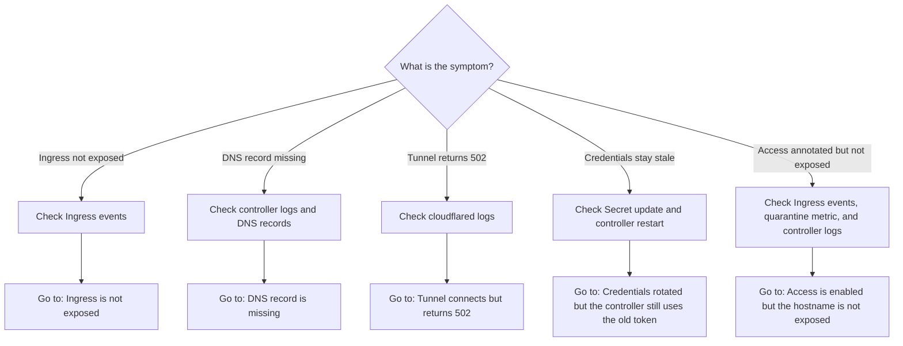
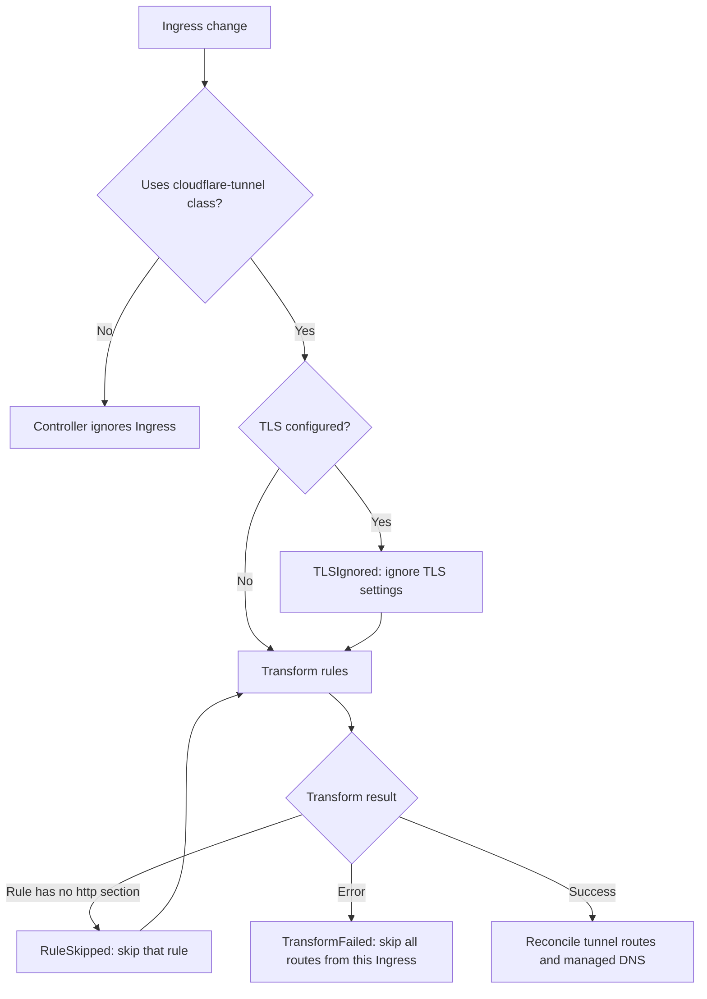

Use this flow to find the right section:



Start by checking that the controller and connector pods are running:

```bash
kubectl get pods -n cloudflare-tunnel-ingress-controller
```

If you used a different Helm release name or namespace, replace them in the commands below.

## Ingress is not exposed

Check that the Ingress uses the `cloudflare-tunnel` class, then inspect its events:

```bash
kubectl get ingress <name> -n <namespace> -o yaml
kubectl describe ingress <name> -n <namespace>
```

The controller reports these warnings:

| Reason             | Event message                                                                                     | What to check                                                                                                                            |
| ------------------ | ------------------------------------------------------------------------------------------------- | ---------------------------------------------------------------------------------------------------------------------------------------- |
| `RuleSkipped`      | `rule for host <host> has no http section, skipped`                                               | Add an `http` section to the rule. Only this rule is skipped.                                                                            |
| `TLSIgnored`       | `ingress has tls specified, SSL Passthrough is not supported, it will be ignored`                 | Remove the `tls` section. Cloudflare terminates TLS at the edge.                                                                         |
| `TransformFailed`  | `<transformation error>`                                                                          | Fix the error in the event message. All routes from this Ingress are skipped until transformation succeeds.                              |
| `AccessNotEnabled` | `ingress requests Cloudflare Access but the controller was started without --access-enabled; ...` | Set `access.enabled=true` in the chart and give the API token the Access permission. All routes from this Ingress are skipped meanwhile. |



Common `TransformFailed` messages:

- `fetch service <namespace>/<service>: ...` when the backend Service does not exist.
- `service <namespace>/<service> has None for cluster ip, headless service is not supported`.
- `service <namespace>/<service> has no port named <port>`.
- `path type in ingress <namespace>/<name> is <pathType>, which is not supported`.

Check controller logs for reconciliation errors:

```bash
kubectl logs deployment/cloudflare-tunnel-ingress-controller \
  -n cloudflare-tunnel-ingress-controller
```

## DNS record is missing

Check the public DNS response, then check controller logs for Cloudflare API, zone, and DNS reconciliation errors:

```bash
dig <hostname>
kubectl logs deployment/cloudflare-tunnel-ingress-controller \
  -n cloudflare-tunnel-ingress-controller
```

Verify that:

- The API token can edit Cloudflare Tunnel and DNS resources and can read the zone.
- The hostname belongs to a zone in the configured Cloudflare account.
- The Ingress does not set [`disable-dns-management: "true"`](/reference/ingress-annotations/).

## Access is enabled but the hostname is not exposed

An ingress that asks for Cloudflare Access is withheld from the tunnel and from DNS whenever the controller cannot produce the application it asked for. A hostname the controller has not published yet goes dark rather than being published unprotected, so start with the Ingress events and then the metrics. One case behaves differently and is covered at the end of this section: a hostname that was already public before you added the annotation stays public while the Access step is failing.

```bash
kubectl describe ingress <name> -n <namespace>
```

An `AccessNotEnabled` warning means the controller was started without `access.enabled`. Check the `command:` list on the controller Deployment for `--access-enabled` and see [Helm values](/reference/helm-values/):

```bash
kubectl get deployment cloudflare-tunnel-ingress-controller \
  -n cloudflare-tunnel-ingress-controller \
  -o jsonpath='{.spec.template.spec.containers[0].command}'
```

A `TransformFailed` warning naming an `access-*` annotation means the annotation set is inconsistent. The message names the key. The three common cases are a stray `access-*` key on an ingress without `access: "true"`, `access` alongside `disable-dns-management`, and `access` on a wildcard host. The last two are unsupported combinations rather than bugs, see [Protect a hostname with Cloudflare Access](/how-to/protect-with-cloudflare-access/).

No event at all, but the hostname is dark and `cloudflare_tunnel_ingress_controller_access_quarantined_hostnames` is non-zero, means the controller withheld the hostname because it could not build a safe Access configuration. Quarantine happens below the Ingress layer, so there is no event to describe; grep the controller log for the hostname:

```bash
kubectl logs deployment/cloudflare-tunnel-ingress-controller \
  -n cloudflare-tunnel-ingress-controller | grep withheld
```

The log line names the hostname and the reason. The two causes are no policies configured from either the annotation or the chart, and two Ingresses exposing the same hostname with conflicting Access settings.

A `CloudflareSyncFailed` event whose message contains `list access applications` means the token lacks the `Access: Apps Write` permission. This one stalls DNS updates for every ingress, not only the annotated one, and `cloudflare_tunnel_ingress_controller_cloudflare_api_errors_total{operation="list_access_applications"}` confirms it. Add the scope described in [Cloudflare credentials](/reference/cloudflare-credentials/) and restart the controller.

A controller pod crash-looping with a policy ID in its message means that ID is not a reusable policy on this account. The controller validates `access.policies` once at startup rather than discovering the problem on a create.

If the hostname is exposed but no Access prompt appears, look for the `not managed by this controller` warning in the controller log. It means an application already exists for that hostname and this controller is leaving it untouched, so nothing you change on the Ingress affects who can reach it.

## A hostname stayed public after turning Access on

Adding the `access` annotation to a hostname the controller already publishes does not take it down while the Access step is failing, and this is the one case where a failing sync leaves a hostname public rather than dark. The sync plans the Access work first and returns on the first error, before the DNS step, so nothing withdraws the tunnel rule or the CNAME written by the last successful sync. The hostname keeps serving with no application in front of it until the underlying failure clears, and `access.resyncInterval` does not bound it, because the resync runs the same sync and fails at the same point.

The symptom is a `CloudflareSyncFailed` event on the Ingress, a rising `cloudflare_tunnel_ingress_controller_cloudflare_api_errors_total`, and a `cloudflare_tunnel_ingress_controller_last_successful_sync_timestamp_seconds` that stops advancing:

```bash
kubectl describe ingress <name> -n <namespace>
curl -sI https://<hostname>/
```

The usual cause is a token that cannot read or write Access applications yet, which also means the controller was not restarted after the permission was added, see [Cloudflare credentials](/reference/cloudflare-credentials/). Until it is fixed, treat the hostname as public. If it must not be reachable in the meantime, remove the Ingress rather than the annotation.

## Tunnel connects but returns 502

A connected tunnel with a `502` response usually cannot reach the backend Service. Check the Service, port, and ready endpoints:

```bash
kubectl get service <service> -n <namespace>
kubectl get endpointslice -n <namespace> \
  -l kubernetes.io/service-name=<service>
```

Then inspect connector logs for the origin connection error:

```bash
kubectl logs deployment/controlled-cloudflared-connector \
  -n cloudflare-tunnel-ingress-controller
```

If the backend expects HTTPS or a specific host name, verify the relevant [Ingress annotations](/reference/ingress-annotations/).

## Credentials rotated but the controller still uses the old token

The controller reads credentials once at startup. Updating the Secret does not refresh a running controller. Restart the controller after rotating credentials:

```bash
kubectl rollout restart deployment cloudflare-tunnel-ingress-controller \
  -n cloudflare-tunnel-ingress-controller
```

See [Cloudflare credentials](/reference/cloudflare-credentials/) for the full credential setup and rotation caveat.
